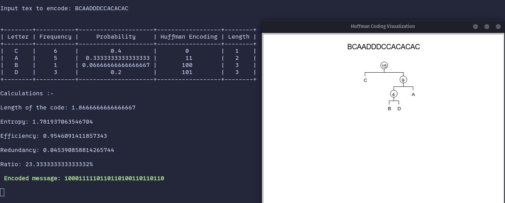

# Huffman Coding
It is a technique of compressing data to reduce its size without losing any of the details. It was first developed by David Huffman.

# Installation

1. clone this repo: `git clone https://github.com/tw0-face/Huffman_encoder.git`
2. `cd Huffman_encoder`
3. `pip install -r requirements.txt`
4. `python huff_encode.py   `

# Demo

> The script prints a pretty table with the statistics and draws the tree using python tirtle library

# Video Demo

https://drive.google.com/file/d/1lErSHnUGp0CQ4k4cT9N8POC_mLwZH4i-/view?t=512
